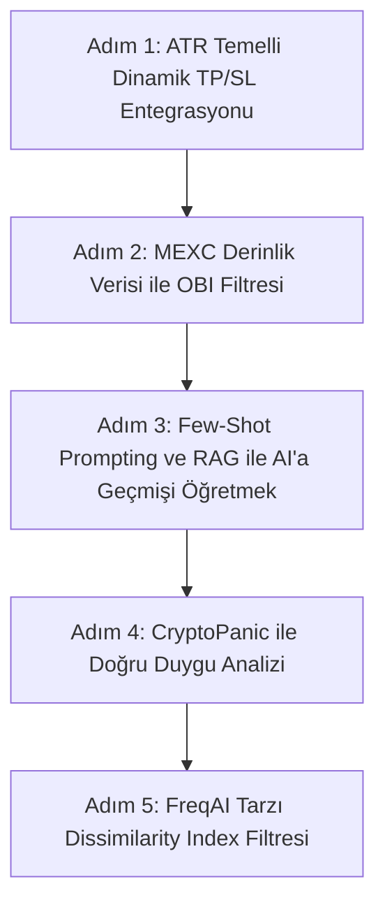

# Sinyal Kalitesi ve Win Rate Artırma Stratejileri

Bu doküman, **Smart Scanner Bot** sayfasındaki sinyallerin kalitesini yükseltmek, hatalı işlemleri (noise) filtrelemek ve genel **Win Rate (Kazanç Oranı)** yüzdesini artırmak için uygulanabilecek mimari, matematiksel ve yapay zeka tabanlı stratejileri kapsamaktadır.

---

## 1. Teknik ve Mikroyapı Filtreleri (Layer 1 & 2 İyileştirmeleri)

Mevcut sistem `confluence.py` ile teknik indikatörleri (RSI, MACD, EMA vb.) oldukça başarılı bir şekilde topluyor. Ancak win rate oranını artırmak için ham fiyatın ötesine geçerek **piyasa mikroyapısı** ve **hacim yoğunluğu** verilerini entegre etmeliyiz.

### A. Market Regime Detection (Piyasa Rejimi Tespiti)
Botların en çok zarar ettiği dönemler, trend takip eden indikatörlerin (EMA Cross, Supertrend) yatay (sideways) piyasada çalıştırılması veya mean-reversion indikatörlerinin (RSI overbought/oversold) güçlü trendlerde terste kalmasıdır.
*   **Çözüm:** AI karar vermeden önce piyasa rejimini belirleyin.
*   **Yöntem:** ADX, Chande Momentum Oscillator (CMO) veya ATR standardizasyonu kullanarak piyasayı 3 sınıfa ayırın: `TRENDING_UP`, `TRENDING_DOWN`, `RANGING`.
*   **Entegrasyon:** Yatay piyasada trend yönlü (EMA Cross) sinyallerini otomatik bloke edin (block/filter). Trend piyasasında ise RSI osilatör sinyallerini devre dışı bırakın.

### B. Order Book Imbalance (OBI) & Stacked Imbalances
Mevcut `market_context.py` içinde Bitget için yazılmış basit bir order book oranı var. Bunu MEXC'ye uyarlayıp derinleştirmeliyiz.
*   **Çözüm:** Sadece en iyi Bid/Ask fiyatlarını değil, derinlikteki (Level 2) yığılmaları ölçün.
*   **Formül:** 
    $$\text{OBI} = \frac{\sum_{i=1}^{N} Q_{bid, i} - \sum_{i=1}^{N} Q_{ask, i}}{\sum_{i=1}^{N} Q_{bid, i} + \sum_{i=1}^{N} Q_{ask, i}}$$
    *(Burada $Q$, belirli bir derinlikteki emir miktarıdır. $N=5$ veya $10$ alınabilir).*
*   **Stacked Imbalance Filtresi:** Eğer alış yönünde (Long) bir sinyal gelmişse, OBI değeri $> 0.60$ (alış baskısı güçlü) olmalı ve en az 3 fiyat seviyesinde ortalama derinliğin 3 katından fazla "destek duvarı" bulunmalıdır. Aksi takdirde sinyal "fakeout" (sahte kırılım) olarak filtrelenir.

### C. Dissimilarity Index (DI) — FreqAI Tarzı Güven Filtresi
Yapay zeka modelleri (özellikle `self_learning` modundaki DeepSeek) daha önce hiç görmediği aşırı dalgalı veya hacimsiz piyasa koşullarında yanlış kararlar verebilir.
*   **Çözüm:** Mevcut piyasa koşullarının (RSI, ATR, Volatilite, Spread vb. özelliklerin) tarihsel başarı verileriyle ne kadar benzeştiğini ölçün.
*   **Yöntem:** Öklid veya Mahalanobis mesafesi kullanarak mevcut anomaliyi (DI) hesaplayın.
*   **Kriter:** Eğer DI değeri belirlediğiniz bir eşiğin üzerindeyse, AI kararı ne olursa olsun işlemi pas geçin.

---

## 2. Yapay Zeka & LLM Karar Mekanizması İyileştirmeleri

Mevcut `smart_filter.py` ve `ai_validator.py` OpenRouter üzerinden DeepSeek ve Perplexity modellerini kullanıyor. Sinyal kalitesini artırmak için bu modellerin yönlendirilmesini (prompting) ve veri beslemesini optimize edebiliriz.

### A. Zero-Shot Yerine Few-Shot Prompting ve RAG
Şu anki promptlar sadece o anki göstergeleri LLM'e verip karar istiyor (Zero-Shot). LLM'ler geçmişte nelerin başarılı olduğunu "görmezse" genelleme hatası yapar.
*   **Çözüm:** Prompt içerisine supabasedeki geçmiş trade geçmişinden **en başarılı 3 Long/Short işlemi** ve **en çok zarar ettiren 3 işlemi** "örnek" (Few-Shot) olarak ekleyin.
*   **Örnek Yapı:**
    ```text
    Aşağıdakiler geçmişte BAŞARIYLA sonuçlanan işlemlerdir:
    - Long | Giriş RSI: 32 | Hacim Oranı: 2.1 | Sonuç: TP Hit (%12 kazanç)
    
    Aşağıdakiler geçmişte KAYIPLA sonuçlanan işlemlerdir:
    - Long | Giriş RSI: 68 | Hacim Oranı: 0.8 | Sonuç: SL Hit (-%3 kayıp)
    
    Mevcut sinyali bu geçmiş kalıplarla kıyasla.
    ```

### B. Gerçek Zamanlı ve Filtrelenmiş Haber Akışı (CryptoPanic Entegrasyonu)
Mevcut `market_context.py` içindeki RSS feed okuyucu oldukça yavaş ve gürültülü haberler çekebilir.
*   **Çözüm:** RSS yerine doğrudan **CryptoPanic API** (ücretsiz sürümü mevcuttur) entegrasyonu yapın.
*   **Fayda:** CryptoPanic haberleri topluluk oylarıyla `Positive`, `Negative`, `Bullish`, `Bearish` olarak etiketler. Yapay zekaya ham haber metinleri yerine bu etiketlenmiş ve önem sırasına dizilmiş haberleri göndermek kararlılık oranını ciddi ölçüde artıracaktır.

### C. Hibrit Yaklaşım: Tabular ML + LLM
Sadece LLM (DeepSeek/Perplexity) kullanmak bazen yavaş kalabilir ve piyasa mum hareketlerini tam anlamıyla analiz edemeyebilir.
*   **Çözüm:** Hafif bir makine öğrenmesi modeli (XGBoost veya LightGBM) arkada çalışarak sayısal verileri (EMA farkları, RSI, OBI) tarasın ve bir "skor" üretsin.
*   **LLM Rolü:** LLM sadece bu ML modelinin onayladığı sinyalleri alır ve üzerine **makro gündem, haberler, ekonomik takvim (Perplexity)** filtrelerini uygular. Bu sayede hem işlem maliyeti düşer hem de hız ve kalite artar.

---

## 3. Risk Yönetimi ve Dinamik İcraat (Execution)

İşlemin kalitesi sadece giriş anıyla değil, nasıl yönetildiğiyle de doğrudan ilişkilidir.

### A. Dinamik TP/SL (ATR Temelli)
Sabit yüzde ile TP/SL koymak (örneğin %1 TP, %0.5 SL), yüksek volatiliteye sahip altcoinlerde (mexc zero-fee listesindeki küçük koinler) anında SL olmaya neden olur.
*   **Çözüm:** Giriş anındaki ATR (Average True Range) değerine göre dinamik TP/SL belirleyin.
*   **Örnek:**
    $$\text{Stop Loss} = \text{Giriş Fiyatı} - (1.5 \times \text{ATR})$$
    $$\text{Take Profit} = \text{Giriş Fiyatı} + (2.5 \times \text{ATR})$$
*   Bu sayede volatil dönemlerde geniş, stabil dönemlerde ise dar makasla işlem açılır.

### B. MEXC Native Trailing Stop (`trackorder` Entegrasyonu)
MEXC'nin borsada çalışan native trailing stop mekanizmasını (`contractPrivatePostTrackorderPlace`) devreye sokun.
*   **Akış:** İşlem açıldıktan sonra fiyat hedefinize geldiğinde (örn: 1.5 * ATR kadar karda), borsa tarafında %1 callback oranlı bir trailing stop başlatın. Böylece büyük trendlerde bot kârı maksimuma kadar taşır ve geri dönüşlerde otomatik kapanır.

---

## 4. İlham Alınabilecek Popüler GitHub Projeleri ve Kütüphaneler

Sinyal kalitesini artırırken tekerleği yeniden icat etmek yerine şu açık kaynak kodlu yapılardan yararlanabilirsiniz:

1.  **[Freqtrade - FreqAI](https://github.com/freqtrade/freqtrade)**
    *   **Ne Alınabilir:** FreqAI'ın `Dissimilarity Index (DI)` ve SVM tabanlı outlier temizleme mekanizması. Verideki gürültüyü (noise) nasıl süzdüklerini incelemek için strateji sınıfları rehber niteliğindedir.
2.  **[hftbacktest](https://github.com/nkaz001/hftbacktest)**
    *   **Ne Alınabilir:** Yüksek frekanslı verilerde (High-Frequency Trading) ve orderbook bazlı tahminlerde en başarılı kütüphanelerden biridir. Jupyter notebook'larındaki "Order Book Imbalance (OBI)" ve "Order Flow Imbalance (OFI)" algoritmaları doğrudan Python kodumuza entegre edilebilir.
3.  **[Jesse AI](https://github.com/jesse-ai/jesse)**
    *   **Ne Alınabilir:** Look-ahead bias (gelecek veriyi geçmişe sızdırma) hatasını engellemek için mükemmel bir backtest ve makine öğrenmesi veri hazırlama yapısına sahiptir.
4.  **[FinRL](https://github.com/AI4Finance-Foundation/FinRL)**
    *   **Ne Alınabilir:** Güçlendirmeli Öğrenme (Reinforcement Learning) ile çoklu ajan mimarilerinin (tıpkı sizin Technical, Risk ve Sentiment ajanlarınız gibi) birbirleriyle nasıl haberleştiğini ve portföy ağırlıklarını nasıl optimize ettiğini gösteren derinlemesne bir kütüphanedir.

---

## 5. Uygulama Adımları (Aksiyon Planı)

Bu iyileştirmeleri kademeli olarak uygulamak için aşağıdaki sırayı takip edebilirsiniz:



Bu adımlar sırasıyla uygulandığında, botun hatalı işlem sayısı (false positives) azalacak ve kazanç oranı (win rate) optimize edilmiş olacaktır.
